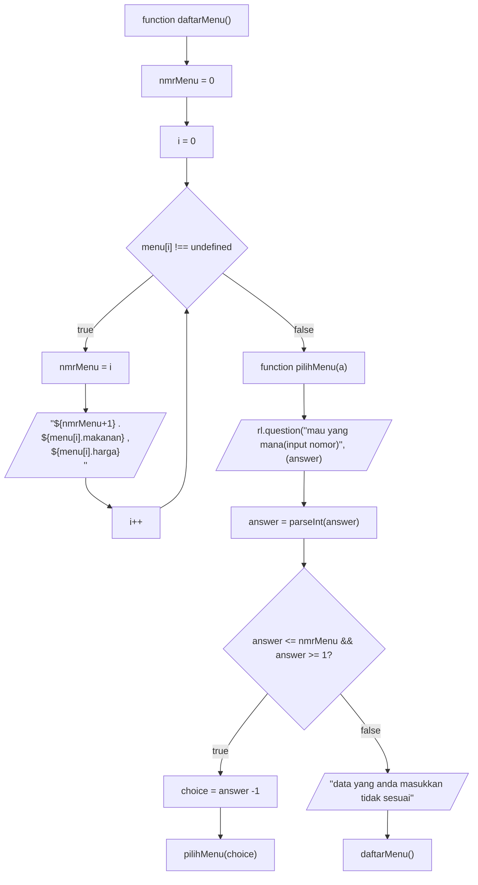
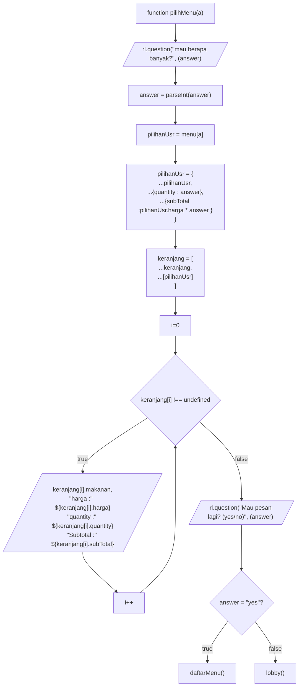

# flowchart function daftarMenu

```mermaid
flowchart TD

fnctDaftarMenu@{shape: rect, label: "function daftarMenu()"}
nmrMenu@{shape: rect, label: "nmrMenu = 0"}
i@{shape: rect, label: "i = 0"}
menuI@{shape: diamond, label: "menu[i] !== undefined"}
nmrI@{shape: rect, label: "nmrMenu = i"}

output1@{shape: lean-r, label: "''${nmrMenu+1} .
${menu[i].makanan} ,
${menu[i].harga}
''"}

i+@{shape: rect, label: "i++"}

fnctPilihMenu@{shape: rect, label: "function pilihMenu(a)"}
mwYgMn@{shape: lean-r, label: "rl.question(''mau yang mana(input nomor)'', 
(answer)"}

parseI@{shape: rect, label: "answer = parseInt(answer)"}
answerC@{shape: diamond, label: "answer <= nmrMenu && answer >= 1?"}

choice@{shape: rect, label: "choice = answer -1"}
plhMenu@{shape: rect, label: "pilihMenu(choice)"}
data@{shape: lean-r, label : "''data yang anda masukkan tidak sesuai''"}
daftarMenu@{shape: rect, label: "daftarMenu()"}


fnctDaftarMenu --> nmrMenu
nmrMenu--> i
i --> menuI
menuI --true--> nmrI
nmrI --> output1
output1 --> i+
i+ --> menuI
menuI --false--> fnctPilihMenu
fnctPilihMenu --> mwYgMn
mwYgMn --> parseI
parseI --> answerC
answerC --true--> choice
choice --> plhMenu
answerC --false--> data
data --> daftarMenu


```
___
# flowchart pilihMenu(a)

```mermaid
flowchart TD

fnctPilihMenu@{shape: rect, label: "function pilihMenu(a)"}
brpBnyk@{shape: lean-r, label: "rl.question(''mau berapa banyak?'', (answer)"}
answerI@{shape: rect, label: "answer = parseInt(answer)"}
pilihanUsr@{shape: rect, label: "pilihanUsr = menu[a]"}
spread@{shape: rect, label: "pilihanUsr = {
...pilihanUsr,
...{quantity : answer},
...{subTotal :pilihanUsr.harga * answer }
}"}
pindahKeranjang@{shape: rect, label: "keranjang = [
...keranjang,
...[pilihanUsr]
]"}
i@{shape: rect, label: "i=0"}
pengecekan@{shape: diamond, label: "keranjang[i] !== undefined"}
output@{shape: lean-r, label: "
keranjang[i].makanan,
''harga :''  ${keranjang[i].harga}
''quantity :'' ${keranjang[i].quantity}
''Subtotal :'' ${keranjang[i].subTotal}
"}
i+@{shape: rect, label: "i++"}
pesanLagi@{shape: lean-r, label: "rl.question(''Mau pesan lagi? (yes/no)'', (answer) "}
tanya@{shape: diamond, label: "answer = ''yes''?"}
i+@{shape: rect, label: "i++"}
daftarMenu@{shape: rect, label: "daftarMenu()"}
lobby@{shape: rect, label: "lobby()"}


fnctPilihMenu --> brpBnyk
brpBnyk --> answerI
answerI --> pilihanUsr
pilihanUsr --> spread
spread --> pindahKeranjang
pindahKeranjang --> i
i --> pengecekan
pengecekan --true--> output
output --> i+
i+ --> pengecekan
pengecekan --false--> pesanLagi
pesanLagi --> tanya
tanya --true--> daftarMenu
tanya --false--> lobby


```