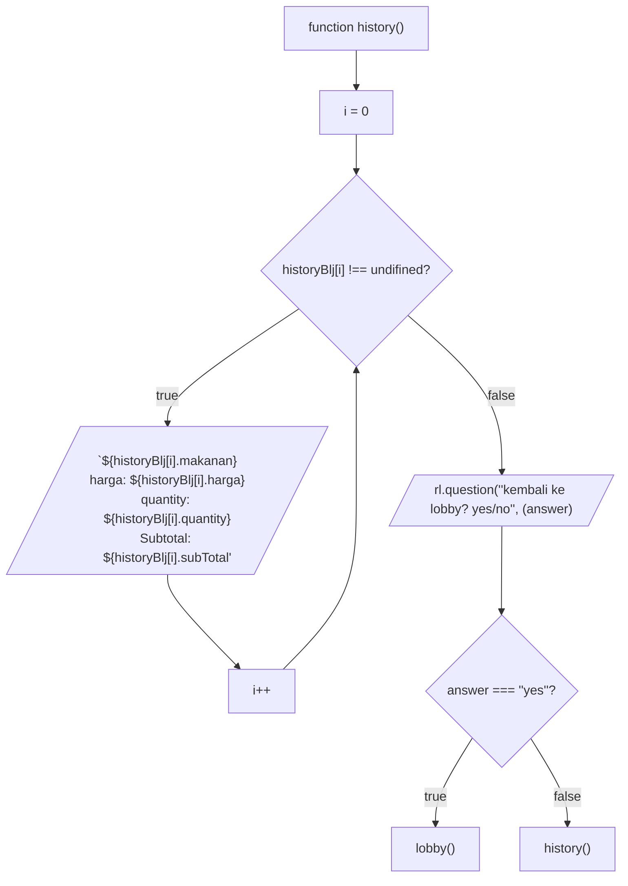

# function history()
---

```mermaid
flowchart TD

fnctHistory@{shape: rect, label: "function history()"}
i@{shape: rect, label: "i = 0"}
i+@{shape rect, label: "i++"}
pengecekan@{shape: diamond, label: "historyBlj[i] !== undifined?"}
output@{shape: lean-r, label: "
`${historyBlj[i].makanan}
harga: ${historyBlj[i].harga}
quantity: ${historyBlj[i].quantity}
Subtotal: ${historyBlj[i].subTotal'"}
back@{shape: lean-r, label: "rl.question(''kembali ke lobby? yes/no'', (answer)"}
back2@{shape: diamond, label: "answer === ''yes''?"}
lobby@{shape: rect, label: lobby()}
history@{shape: rect, label: history()}


fnctHistory --> i
i --> pengecekan
pengecekan --true--> output
output --> i+
i+ --> pengecekan
pengecekan --false--> back
back --> back2
back2 --true--> lobby
back2 --false--> history 


```