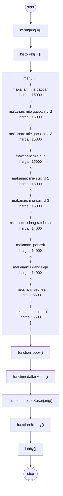

# Flowchart halaman utama
___

```mermaid 
flowchart TD

start@{shape: circle, label : "start"}
stop@{shape: dbl-circ, label : "stop"}
keranjang@{shape: rect, label: "keranjang =[]"}
historyBlj@{shape: rect, label: "historyBlj = []"}
fnctLobby@{shape: rect, label: "function lobby()"}
lobby@{shape: rect, label: "lobby()"}
fnctHistory@{shape: rect, label: "function history()"}
menu@{shape: rect, label: "menu = [
    {
 makanan: mie gacoan
harga : 15000
},
{
 makanan: mie gacoan lvl 2
harga : 15000
},
{
 makanan: mie gacoan lvl 3
harga : 15000
},
{
 makanan: mie suit
harga : 15000
},
{
 makanan: mie suit lvl 2
harga : 15000
},
{
 makanan: mie suit lvl 3
harga : 15000
},
{
 makanan: udang rambutan
harga : 14000
},
{
 makanan: pangsit
harga : 14000
},
{
 makanan: udang keju
harga : 14000
},
{
 makanan: iced tea
harga : 6500
},
{
 makanan: air mineral
harga : 6500
}
]"}
fnctProsesKeranjang@{shape: rect, label: "function prosesKeranjang()"}
fnctDaftarMenu@{shape: rect, label: "function daftarMenu()"}


start --> keranjang
keranjang --> historyBlj
historyBlj --> menu
menu -->  fnctLobby
fnctLobby --> fnctDaftarMenu
fnctDaftarMenu --> fnctProsesKeranjang
fnctProsesKeranjang --> fnctHistory
fnctHistory --> lobby
lobby --> stop


```