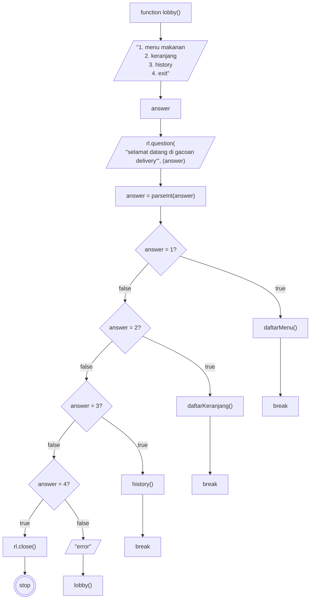

# Flowchart function lobby

```mermaid
flowchart TD

fnctLobby@{shape: rect, label: "function lobby()"}
awal@{shape: lean-r, label: "''1. menu makanan
2. keranjang
3. history
4. exit''"}
answer@{shape: rect, label: "answer"}
gacoan@{shape: lean-r, label: "rl.question(
''selamat datang di gacoan delivery''', (answer)"}
answerP@{shape: rect, label : "answer =  parseInt(answer)"}
answer1@{shape: diamond, label: "answer = 1?
"}
daftarMenu@{shape: rect, label: "daftarMenu()"}
answer2@{shape: diamond, label: "answer = 2?"}
daftarKeranjang@{shape: rect, label: "daftarKeranjang()"}
answer2@{shape: diamond, label: "answer = 2?"}
daftarKeranjang@{shape: rect, label: "daftarKeranjang()"}
answer3@{shape: diamond, label: "answer = 3?"}
history@{shape: rect, label: "history()"}
answer4@{shape: diamond, label: "answer = 4?"}
close@{shape: rect, label: "rl.close()"}
err@{shape: lean-r, label : "''error''"}
lb@{shape: rect, label: "lobby()"}
stop@{shape: dbl-circ, label: "stop"}
break1@{shape: rect, label : "break"}
break2@{shape: rect, label : "break"}
break3@{shape: rect, label : "break"}


fnctLobby --> awal
awal --> answer
answer --> gacoan
gacoan --> answerP
answerP --> answer1
answer1 --true--> daftarMenu
daftarMenu --> break1
answer1 --false--> answer2
answer2 --true--> daftarKeranjang
daftarKeranjang --> break2
answer2 --false--> answer3
answer3 --true--> history
history --> break3
answer3 --false--> answer4
answer4 --true--> close
close --> stop
answer4 --false--> err
err --> lb


```
