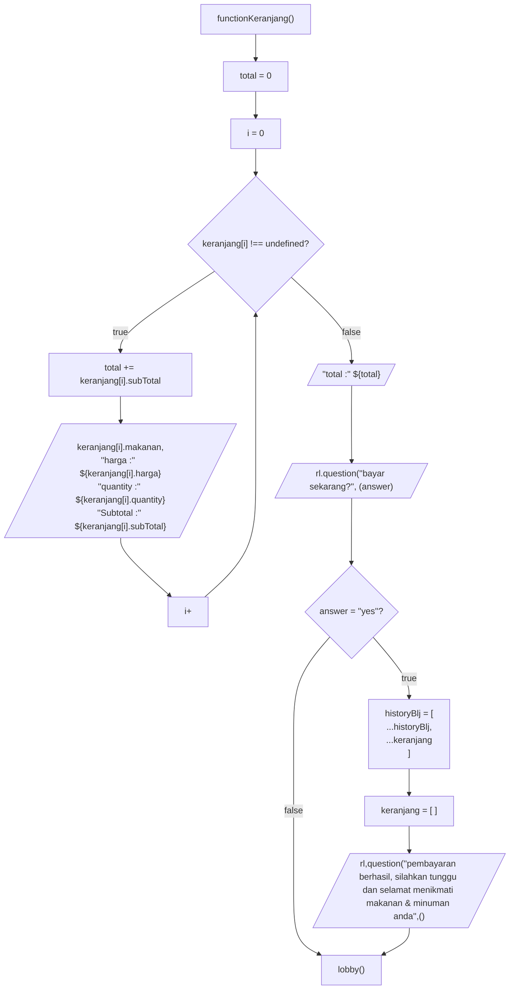

# flowchart function prosesKeranjang

```mermaid
flowchart TD

fnctProsesKeranjang@{shape: rect, label: "functionKeranjang()"}
total@{shape: rect, label: "total = 0"}
i@{shape: rect, label: "i = 0"}
keranjangI@{shape: diamond, label: "keranjang[i] !== undefined?"}
total2@{shape: rect, label: "total += keranjang[i].subTotal"}
total3@{shape: lean-r, label: "
keranjang[i].makanan,
''harga :''  ${keranjang[i].harga}
''quantity :'' ${keranjang[i].quantity}
''Subtotal :'' ${keranjang[i].subTotal}
"}
i+@{shape: rect, label: "i+"}
outputTotal@{shape: lean-r, label: "''total :'' ${total}"}
bayarS@{shape: lean-r, label: "rl.question(''bayar sekarang?'', (answer)"}
answerY@{shape: diamond, label: "answer = ''yes''?"}
lobby@{shape: rect, label: "lobby()"}
historyBlj@{shape: rect, label: "historyBlj = [
 ...historyBlj,
...keranjang
]"}
keranjang@{shape: rect, label: "keranjang =  [ ]"}
outputByr@{shape: lean-r, label: "rl,question(''pembayaran berhasil, silahkan tunggu dan selamat menikmati makanan & minuman anda'',()" }


fnctProsesKeranjang --> total
total --> i
i --> keranjangI
keranjangI --true--> total2
total2 --> total3
total3 --> i+
i+ --> keranjangI
keranjangI --false--> outputTotal
outputTotal --> bayarS
bayarS --> answerY
answerY --false--> lobby
answerY --true--> historyBlj 
historyBlj --> keranjang
keranjang --> outputByr
outputByr --> lobby


```